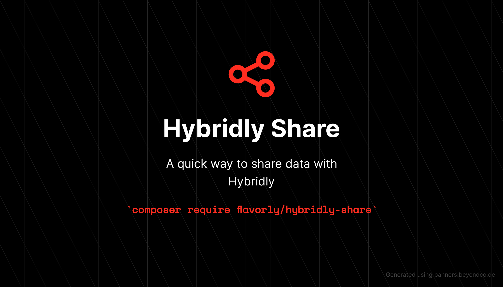

# Hybridly Share ⚡

<p align="center"></p>

[](https://packagist.org/packages/flavorly/hybridly-share)
[](https://github.com/flavorly/hybridly-share/actions?query=workflow%3Arun-tests+branch%3Amain)
[](https://github.com/flavorly/hybridly-share/actions?query=workflow%3A"Check+%26+fix+styling"+branch%3Amain)
[](https://packagist.org/packages/flavorly/hybridly-share)

A Quick way to flash & share variables to [Hybridly](https://hybridly.dev/) that persist on session or cache. Really useful for redirects & returns!
Sharing to Hybridly anywhere :)

## Installation

You can install the package via composer:

```bash
composer require flavorly/hybridly-share
```

You can publish the config file with:

```bash
php artisan vendor:publish --tag="hybridly-share-config"
```

This is the contents of the published config file:

```php
<?php
return [
    /*
    |--------------------------------------------------------------------------
    | Driver Configuration
    |--------------------------------------------------------------------------
    |
    | You can configure hybridly share to use session or cache as the driver.
    | when using the cache driver hybridly share will leverage your current
    | cache driver and attempt to save the temporary shared keys there.
    | A unique key is used to generate the unique key for each user
    |
    | Drivers: 'cache' or 'session' are supported.
    | Prefix Key : hybridly_container_
    | Cache TTL : Time in seconds to store the keys in cache.
    */

    'prefix_key' => 'hybridly_container_',
    'driver' => 'session',

    'session-driver' => \Flavorly\HybridlyShare\Drivers\SessionDriver::class,
    'cache-driver' => \Flavorly\HybridlyShare\Drivers\CacheDriver::class,

    'cache-ttl' => 60,

    /*
    |--------------------------------------------------------------------------
    | Persistent Keys
    |--------------------------------------------------------------------------
    |
    | Here you may configure the keys that should be persisted on the session,
    | even if they are empty they will be mapped to their primitives configured here.
    |
    */
    'persistent-keys' => [
        // 'some-key' => 'some-value',
        // 'messages => [],
    ],


    /*
    |--------------------------------------------------------------------------
    | Ignore URLs & Params
    |--------------------------------------------------------------------------
    |
    | The URls to ignore by default, because hybridly runs on web middleware
    | Default For URLS: ['broadcasting/auth']
    |
    */
    'ignore_urls' => [
        'broadcasting/auth',
    ],
];
```

## Usage

You can use the Hybridly Share helper anywhere from your code and share your variables directly to Hybridly.
Keep in the mind that the values will only be kept on the current or next request lifecycle, they will be flushed once shared to Hybridly.
You may also use closures that under-the-hood will be converted to Laravel Closure Serializer ( Previously Opis )

```php
use Flavorly\HybridlyShare\HybridlyShare;

// Resolve from container
$flash = app(\Flavorly\HybridlyShare\HybridlyShare::class);
$flash->share('foo', 'bar');

// Or using the helper
hybridly_share()->share('foo', 'bar');

// With a closure that will be serialized
hybridly_share()->share('foo', fn() => 'bar');

// With a nested closure
hybridly_share()->share('foo', ['bar' => 'foo', 'baz' => fn() => 'bar']);

// On Controllers return back()
return back()->hybridly('foo', 'bar');

// return back() + Closures
return back()->hybridly('foo', function () {
    return 'bar';
});

// Or the way cool way
hybridly_share()->share('foo', fn() => 'bar');

// Returning + the cool way
return back()->hybridly('foo', fn() => 'bar');


// Appending Data
hybridly_share()->share('fruits', 'bananas',true);
hybridly_share()->share('fruits', 'oranges', true);

// Conditional Sharing
hybridly_share()->shareIf($foo === true, 'foo', 'bar');
hybridly_share()->shareUnless($foo === false, 'foo', 'bar');

// Appending
// You can also use append on regular share method as the third parameter
hybridly_share()->append('foo', 'bar');

// Sharing to a user
// Only available if driver is cache, otherwise session will always use the current logged user
hybridly_share()->forUser($user)->append('foo', 'bar');
```

# Why Hybridly Share?

This package is intended to be used with the [Hybridly](https://hybridly.dev/) framework. 
Hybridly provides a nice way to share variables, but sometimes you might want to share data from somewhere else in your code.

Few use cases :
- Sharing data before a redirect ( Ex: back()->with('foo','bar') can be replicated with back()->hybridly('foo','bar') )
- Sharing data from a controller to a view without using hybridly()->share()
- Sharing data from a service directly
- Sharing data from any point of your code before serving a request/page
- Sharing data from a command/job to a specific user
- Avoiding Hybridly Middleware pollution with sharing session variables back and forth.
- etc..

If you are looking for real-time sharing this package might not be your best choice, and would recommend using [Laravel Echo](https://github.com/laravel/echo) paired together with Pusher or [Soketi](https://docs.soketi.app/).

## Testing

```bash
composer test
```

## Security Vulnerabilities

Please review [our security policy](../../security/policy) on how to report security vulnerabilities.

## Credits

- [jon](https://github.com/flavorly)
- [All Contributors](../../contributors)

## License

The MIT License (MIT). Please see [License File](LICENSE.md) for more information.
